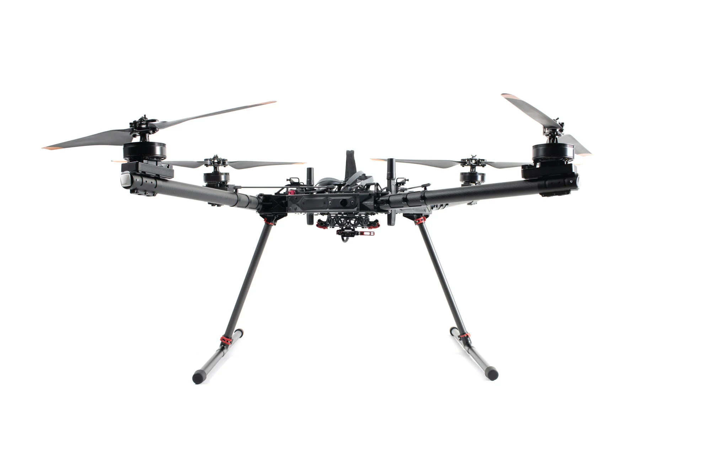

# Getting Started

<figure><figcaption></figcaption></figure>

## 1. Unboxing and Assembly

a. Remove the landing gear components from the top lid of the case.

b. Insert leg tubes into T-joints until seated, lock red clamps. _(The leg tubes and skids are interchangeable.)_

<figure><figcaption></figcaption></figure>

c. Place Alta X Gen2 upside down, open locking levers, insert landing gear into leg mounts. Ensure both levers and safety latches are fully engaged.

<figure><figcaption></figcaption></figure>

d. Flip aircraft onto landing gear.

e. If using a payload, connect it to the Smart Dovetail while aircraft is powered off. _(Payloads are not hot swappable)_

## 2. Power On

a. Power on Pilot Pro. Wait for the tablet to boot up.

b. For ground operation: Connect one battery using the fused cable to either battery connector on Alta X Gen2.

c. For flight: Connect two batteries directly (no fused cable).


**Safety Note:** Always use the fused cable with a single battery when not flying. This prevents accidental arming. Never connect a second battery through the fused cable.


d. Wait for the LED on the Pilot Pro's power button to turn green. Then open the AMC app.

## 3. Connect to WiFi and Auterion Suite (Optional)

_Enables automatic log uploads, online fleet and asset management, and direct log sharing with Freefly support—the fastest way to get help if issues arise._

a.  With Alta X Gen2 powered on, open AMC and navigate to Vehicle Overview > Connectivity.

<figure><figcaption></figcaption></figure>

b.  Enable WiFi (not hotspot mode), enter network credentials, and click Connect.

<figure><figcaption></figcaption></figure>

c. Connect USB-C cable from computer to Alta X Gen2 (port located near battery connectors).

d. Navigate to http://10.41.1.1 in a web browser.

e. Follow prompts to create account or add aircraft to existing fleet.

f. Once the registration is complete, navigate to http://10.41.1.1. Enable Cloud Services and Flight Log Upload in Settings.

## 4. Charge and Update

You should have received an Alta X Gen2 in a case and a separate shipment of Alta X Gen2 batteries and chargers (We have to ship separately due to Dangerous Goods shipping requirements.)

a. Charge aircraft batteries using a Tattu Smart Charger. _(Balance leads are not required for charging the Gen2 Smart Batteries)._&#x20;

b. Charge Pilot Pro with the included 45W USB-C charger.

<figure><figcaption></figcaption></figure>

c. Verify firmware is current on both aircraft and controller.

## 5. Go Flying

a. While the batteries and controller are charging, read the [Broken link](/broken/pages/S2Ubs4iM85ywighYen7z "mention").

***

This Aircraft Flight Manual describes the complete operation of airframe and flight control systems, and the normal maintenance of those items. Do not operate Alta X Gen2 without reading and understanding this manual.

‌This manual is not a substitute for adequate flight training. Training requirements can vary when operating in different countries or under different flight conditions. Always consult local regulations before flying Alta X. In areas where there are no flight training requirements, it is the sole determination of the pilot-in-command as to whether he or she has the appropriate level of training or experience for a given flight. Always set and adhere to personal minimums and fly within your own capabilities.

