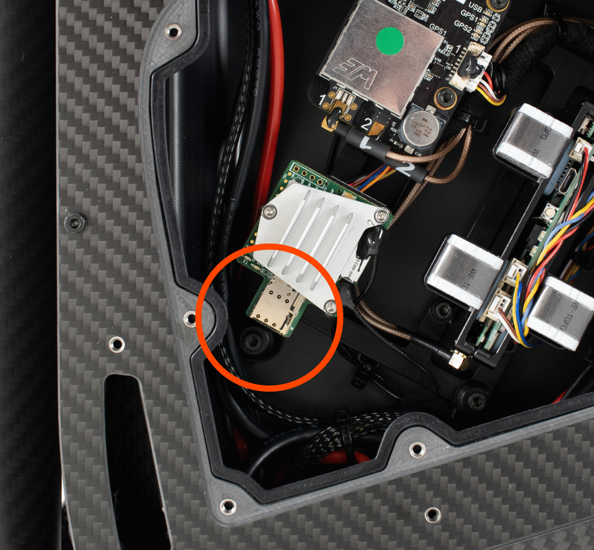

# Network and Connectivity

### WiFi

This section describes the connection process for Alta X Gen2's built-in WiFi radio. This functionality is useful while the aircraft is on the ground, for admin and setup tasks. Connecting the Alta X Gen2 to wifi is required to complete the initial [Auterion Suite setup process](https://freefly.gitbook.io/astro-public/pilots-operating-handbook/essential-software/auterion-suite).

#### Connect the Alta X Gen2 aircraft to a wifi network







1. Open AMC GCU or PC. If using a PC, connect to Alta X Gen2 with a USB-C cable.
2. Tap on the vehicle status button at the top of the AMC screen (it will be either red, yellow, or green depending on the vehicle's status).
3. Select Connectivity.
4. Enable Wifi and disable Hotspot Mode.
5. Scan for the network then click on it and enter the password, then connect.




Alta X Gen2's WiFi module is compatible with 5.8GHz and 2.4GHz bands. When possible, use 5.8GHz for better throughput and performance.


#### Connect to the Alta X Gen2 hotspot via WiFi

1. Open AMC on Pilot Pro or via a computer. If using a PC, connect to Astro with a USB-C cable.
2. Power Alta X Gen2.
3. Tap the icon in the top-left of AMC. Navigate to Vehicle Setup > WiFi.
4. Set Wifi Mode to Hotspot, which allows Alta X Gen2 to broadcast a WiFi network that other devices can connect to.

***

### LTE

If your Alta X Gen2 has an LTE sim card installed, you can utilize online features such as live video, real-time aircraft status, and flight logs through [Auterion Suite](https://freefly.gitbook.io/astro-public/pilots-operating-handbook/essential-software/auterion-suite).


Currently, Alta X Gen2 is only available with an LTE radio suitable for North American markets. Additional LTE compatibility will be available in the future.


#### Configure and Enable / Disable

1. [Install a SIM card](standard-maintenance-procedures.md#installing-a-sim-card) into Alta X Gen2. Make sure to write down the SIM card number found on the card if you don't have it recorded elsewhere.
2. Open AMC on Pilot Pro or a connected PC
3. Navigate to Vehicle Setup > Cellular
4. If you need to access the IMEI number for the vehicle to enable the SIM card, connect to the Alta X Gen2 with a PC and USB-C cable
   1. Power on Alta X Gen2 with one battery and the fused cable only.
   2. Using a web browser, navigate to [http://10.41.1.1/](http://10.41.1.1/) then click "System Status" in the sidebar.
   3.  Scroll until you find the listed IMEI information 

       <figure><figcaption></figcaption></figure>

#### Hardware Disable

You can assure that LTE is not being used by [removing the SIM ](https://freefly.gitbook.io/astro-public/astro/maintenance-manual/replacing-components/installing-a-sim-card#installing-a-sim-in-astro)card from Alta X Gen2.

#### Frequencies and Compatibility

| Region         | 4G LTE Bands                    | Radio Spec Sheet                                                                                                                                                                                                       |
| -------------- | ------------------------------- | ---------------------------------------------------------------------------------------------------------------------------------------------------------------------------------------------------------------------- |
| North America  | B2, B4, B5, B13, B17            | [https://www.sierrawireless.com/products-and-solutions/embedded-solutions/products/hl7588-accessory-board/](https://www.sierrawireless.com/products-and-solutions/embedded-solutions/products/hl7588-accessory-board/) |
| EMEA/Australia | Cat-4: B1, B3, B7, B8, B20, B28 | [https://www.sierrawireless.com/products-and-solutions/embedded-solutions/products/rc7620/](https://www.sierrawireless.com/products-and-solutions/embedded-solutions/products/rc7620/)                                 |


Currently, Alta X Gen2 is only available with an LTE radio suitable for North American markets. Additional LTE compatibility will be available in the future.


#### Changing SIM / Service Provider

When switching SIM cards, try leaving the APN field blank. It should be automatically detected. If not, here are a few suggestions.

| Carrier  | APN                                                                                                                 |
| -------- | ------------------------------------------------------------------------------------------------------------------- |
| T-mobile | iot.tmowholesale, fast.t-mobile.com                                                                                 |
| Orange   | orange.m2m.spec                                                                                                     |
| Verizon  | See: [https://www.verizon.com/support/knowledge-base-46578/](https://www.verizon.com/support/knowledge-base-46578/) |

In most cases, check the "Allow Roaming" box.

After changing the SIM, reboot both the aircraft and AMC.

***

### Installing a SIM card

Alta X Gen2 has an onboard North American LTE modem for remote connectivity. To install a SIM card:

1.  Place Alta X Gen2 upside down on a clean flat surface with the nose pointing away from you.&#x20;

    <figure><figcaption></figcaption></figure>
2.  Using the included 2mm hex driver, remove the 9 screws from the bay door on the left side of the aircraft.

    <figure><figcaption></figcaption></figure>
3.  Remove the carbon fiber panel.&#x20;

    <figure><figcaption></figcaption></figure>
4.  Insert the SIM card into the SIM card slot on the LTE modem. Ensure the card is fully seated and clicks in.&#x20;

    <figure><figcaption></figcaption></figure>

5.  Reinstall the carbon fiber panel and loosely screw in all 9 screws holding the panel in place.&#x20;

    <figure><figcaption></figcaption></figure>
6. Once all screws are installed, hand tighten all screws, working in a star pattern around the panel.
7. Power on Pilot Pro.
8. Power on Alta X Gen2 with one battery and the fused cable.&#x20;
9. Open AMC on Pilot Pro, click vehicle overview, select connectivity, then LTE.&#x20;
10. Enter the APN for the cellular service provider in the box, then click save.
11. Verify the cellular status shows connected.

