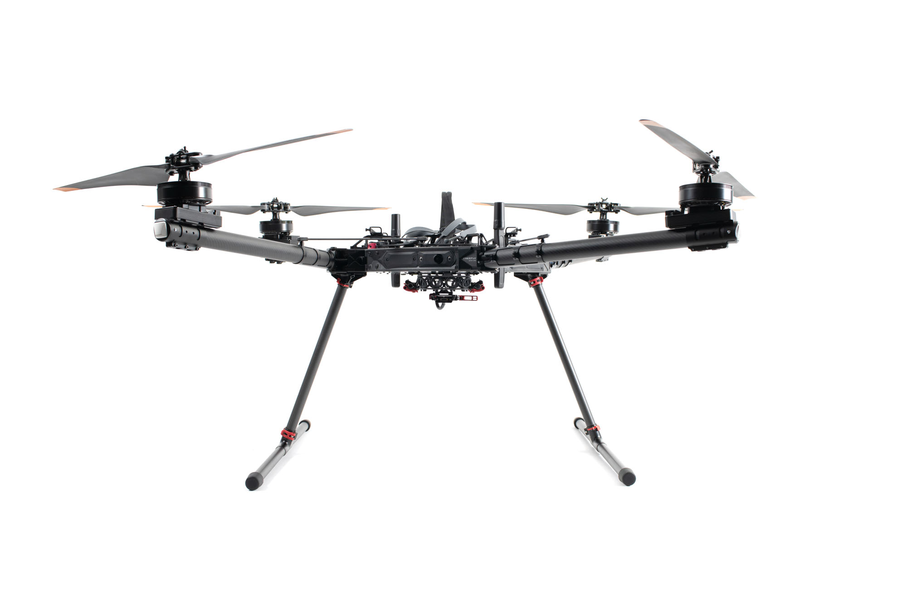
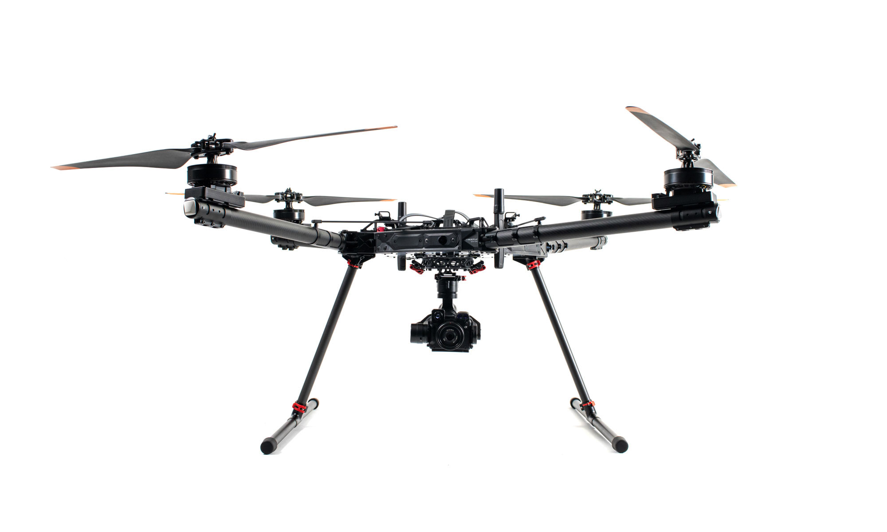
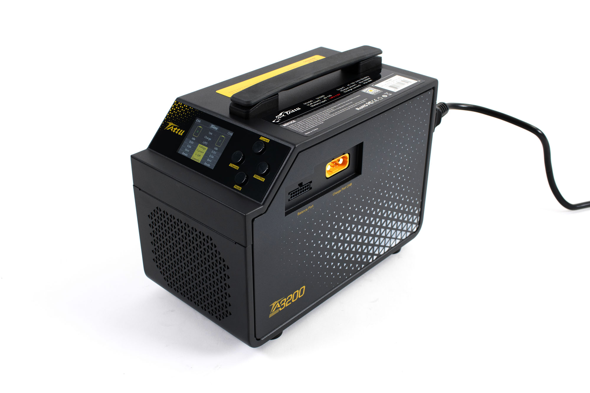

# System Overview

<figure><figcaption></figcaption></figure>

Alta X Gen2 is a professional multi-rotor aircraft designed for demanding cinematic, professional, and industrial applications. Building on the proven foundation of the original Alta X and incorporating advanced technologies from Astro, Gen2 delivers significant performance improvements alongside enhanced intelligence and capability. Alta X Gen2 continues the Freefly tradition of expandability and customization while bringing new innovations to the reliable workhorse platform that Alta pilots trust for their most critical missions.

## Key Components

### Alta X Gen2

Alta X Gen2 comes standard with 12mm rails and the Smart Dovetail isolator for quick payload swaps.

<figure><figcaption></figcaption></figure>

### Pilot Pro

Alta X Gen2 ships with [Pilot Pro](https://freeflysystems.com/pilot-pro), our custom controller, with either Herelink or Doodle radio. For more information, check the [Pilot Pro wiki](https://freefly.gitbook.io/pilot-pro-public/).

<figure><figcaption></figcaption></figure>

### Batteries

Alta X Gen2 is designed to operate with two Tattu Plus 1.0 12S 16Ah smart batteries with AS150U connectors.

<figure><figcaption></figcaption></figure>

### Charger

The Tattu TA3200 smart battery charger enables single connector charging for ease of use.

<figure><figcaption></figcaption></figure>

