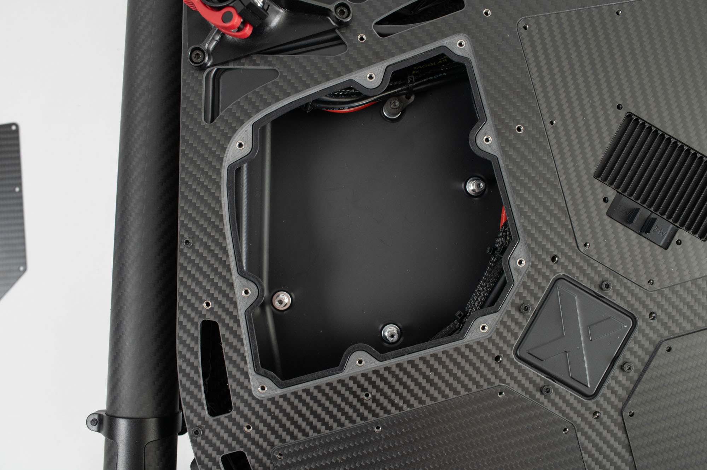

# Drawings & CAD

### Aircraft Dimensions

| Dimension                                                                                       | Length \[mm] |
| ----------------------------------------------------------------------------------------------- | ------------ |
| Unfolded Diameter (not including props)&#xD;                                                    | 1570         |
| Unfolded Diameter (Including Props)&#xD;                                                        | 2273         |
| Folded Diameter&#xD;                                                                            | 877          |
| Height with landing gear (medium legs, ground to top of prop mount)&#xD;                        | 694          |
| 
Height from chassis underside to ground

(medium leg length landing gear, included)
 | 450          |
| 
Height from chassis underside to ground 

(long leg length landing gear)
            | 580          |

### Mounting Interfaces - Chassis Underside

<figure><figcaption></figcaption></figure>



### Electronics Bay Door

Electronics bay access panel.  Start with this model and customize as needed. &#x20;

<figure><figcaption></figcaption></figure>





### Electronics Bay Mount Interface

Location of four mounting posts in electronics bay and a sample part. &#x20;

<figure><figcaption></figcaption></figure>

<figure><figcaption></figcaption></figure>


