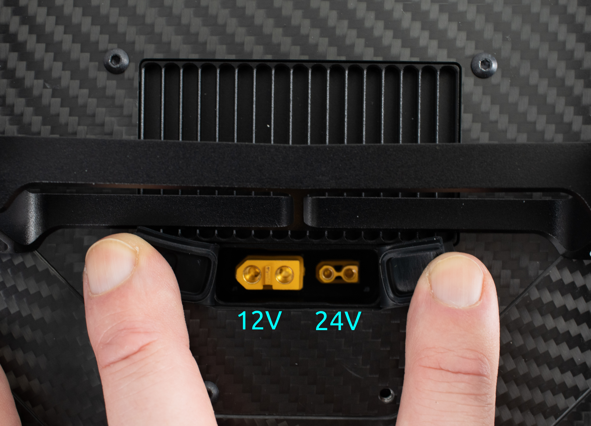

# Interfaces

Alta X Gen2 was designed to be easy to integrate custom payloads with a variety of electrical and communications interfaces.

### **USB-C** 

<figure><figcaption></figcaption></figure>

The USB-C connector is located on the top side chassis next to the battery connectors.&#x20;

By default it is configured as an ethernet adapter.

Functionality:

* connection to payload
* mass storage (e.g. flash drive)
* firmware updates

It is not possible to power Alta X Gen2 via this port.

### IO Panel

The IO panel is located in the forward bay door underneath the aircraft.

<figure><figcaption></figcaption></figure>

#### Payload 

Connector type: JST-ZPD 26-pin

This connector can be accessed directly or to pass connections to the [Smart Dovetail](https://docs.freeflysystems.com/astro/other-user-manuals/ecosystem/development-tools/payload-mounting-interfaces#smart-dovetail) connector.

The mating connector to build a payload cable is [ZPDR-26V-S](https://www.digikey.com/en/products/detail/jst-sales-america-inc/ZPDR-26V-S/2472569).

PAYLOAD\_VBAT is 24V DC regulated, and is electronically fused at 6A. If the e-fuse trips, it will reset when the aircraft is power cycled. The e-fuse includes soft start protection for use with loads with high inrush current.&#x20;

#### TELEM3  

Connector: JST GH 6-pin

#### **AUX UART** 

Connector: JST GH 6-pin

#### **PWM** 

Connector: pin headers, 0.1 inch spacing

PWM outputs are active when the aircraft is powered on.

The PWM outputs on the Alta X Gen2 are controlled with the PWM\_AUX\_FUNC parameter where FUNC1-4 are the 4 PWM outputs. To assign a PWM output to a mapping, just find the number of the PWM output, and the associated PWM\_AUX\_FUNC and assign it to the desired mapping. ie, if you use RC AUX 1, it should use Dial 2 to control the PWM output.PWM output values (e.g. 1100 us) are controlled by these parameters (read more in the [PX4 Parameter Reference](https://docs.px4.io/main/en/advanced_config/parameter_reference#parameter-reference)).

| Parameter       | Function                                                                                                                                                    |
| --------------- | ----------------------------------------------------------------------------------------------------------------------------------------------------------- |
| PWM\_AUX\_DIS1  | PWM output when autopilot is not armed. When set to -1 the value for PWM\_AUX\_DISARMED will be used. a similar parameter is available for each channel     |
| PWM\_AUX\_MIN1  | Minimum PWM pulse for this output. When set to -1 the value for PWM\_AUX\_MIN will be used.                                                                 |
| PWM\_AUX\_MAX1  | Maximum PWM pulse for this output. When set to -1 the value for PWM\_AUX\_MAX will be used.                                                                 |
| PWM\_AUX\_REV1  | Invert direction.                                                                                                                                           |
| PWM\_AUX\_FAIL1 | PWM output if autopilot is in failsafe mode. When set to -1 the value is set automatically depending if the actuator is a motor (900us) or a servo (1500us) |

#### Ethernet

Connector: JST GH 6-pin

<figure><figcaption></figcaption></figure>

This Ethernet port is connected to the Ethernet switch on the IO panel and connects to the payload and Skynode.

A secondary RJ45 jack is also available inside the tub on the IO panel PCBA. This is connected to the same Ethernet switch as the ENET GH connector.&#x20;

<figure><figcaption></figcaption></figure>

#### XT30 Power

The XT30 connector supplies regulated 24V DC power. It's electronically fused at 6A. If tripped, it will reset when the aircraft is power cycled.  This 24V source is shared with the other 24V connection points on the aircraft. The e-fuse includes soft start protection for use with loads with high inrush current.&#x20;

### External Power Connectors

In the rear bay of the aircraft, there are external facing power connectors.&#x20;

Both of these are regulated from the battery voltage.&#x20;

* 12V is available up to 120W or 10A.&#x20;
* 24V is available up to 240W or 10A.&#x20;

### Rear Power Connections

Alta X Gen2 provides power connections inside and outside the aircraft tub. This is useful for integrations that sit in the payload bay, or for devices that are attached outside of the tub.&#x20;

<figure><figcaption></figcaption></figure>

<figure><figcaption></figcaption></figure>

#### 12V power

12V power is available on XT60 connectors, one internal and one external.&#x20;

Max current draw is 10A/120W

#### 24V power

24V power is available on the XT30 connectors on the DC-DC regulator, one internal and one external. This source is shared with the payload ZPD connector and the IO panel XT30 connector.

Max current draw is 10A/240W


VBAT (\~44V) is also available on an XT30 connector, always double check the voltage on the connector before plugging something in.



Keep in mind, when drawing power from the 12V or 24V regulators on the ground, the heatsink may become warm to the touch. Once in flight, airflow around the aircraft helps keep it cool.


#### VBAT power

The battery breakout board includes 4x XT30 connectors fused at 10A each. One of these feeds the 12/24V DC-DC regulator, but the remaining connectors are available for use.&#x20;

These are electrically connected directly to the battery bus, nominally 44.4V (12S LiPo).

### Onboard Network Connectivity

The Ethernet switch on Alta X Gen2 provides connectivity to attach payloads or custom devices to the aircraft's onboard network. Any device on the switch can access any other devices connected to the switch, including the Skynode and Payload.&#x20;

The internal network is setup with the subnet 192.168.144.0/24, with subnet mask 255.255.255.0.&#x20;

IP addresses are statically allocated. The reserved addresses include:

| IP             | Endpoint      |
| -------------- | ------------- |
| 192.168.144.10 | Airside Radio |
| 192.168.144.11 | Pilot Pro     |
| 192.168.144.12 | Ground Radio  |
| 192.168.144.20 | Skynode       |

Ethernet based payloads generally have reserved IP addresses that vary per payload.

To connect a custom device, we recommend using an IP address in the range of

&#x20;`192.168.144.200` -  `192.168.144.255`.


The radio link to the ground has limited bandwidth, and the internal network is 10/100mb Ethernet. Be mindful of the bandwidth needs of custom devices when connecting them to the aircraft to not overload the network.

